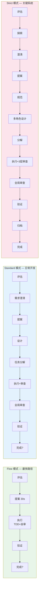
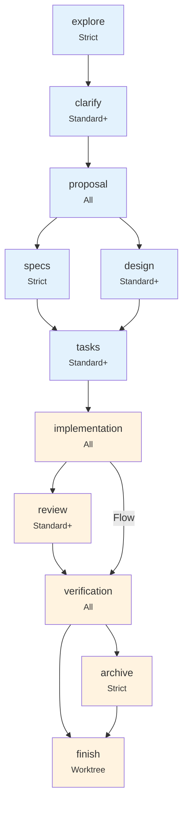
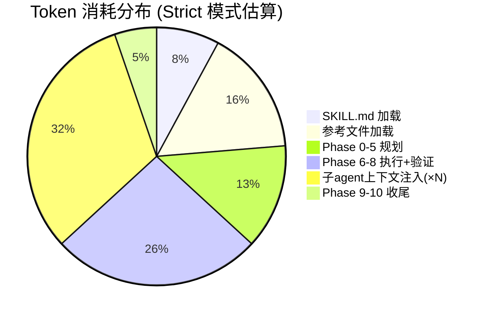
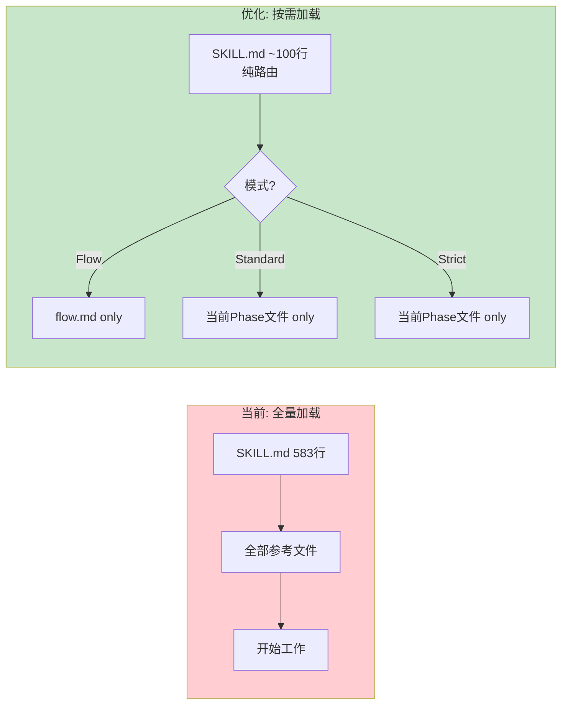
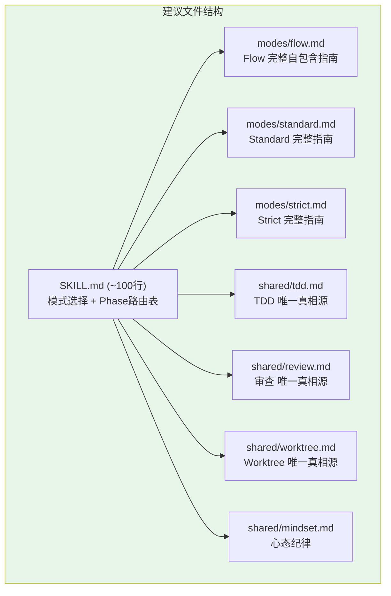

# SpecPower 融合分析：OpenSpec + Superpowers

> 分析日期: 2026-04-20 | 版本: v1.7.1

---

## 1. 完整工作流 Mermaid 图

### 总览（含来源标识）

```mermaid
%%{init: {'theme': 'base', 'themeVariables': {'primaryColor': '#E8F4FD', 'secondaryColor': '#FFF3E0'}}}%%
flowchart TD
    subgraph Phase0["Phase 0: 模式评估 — 融合创新"]
        direction TB
        P0A[初判信号扫描] --> P0B{边界情况?}
        P0B -->|是| P0C[30s快速验证<br/>Glob/Grep/测试覆盖]
        P0B -->|否| P0D[确认模式<br/>Flow/Standard/Strict]
        P0C --> P0D
    end

    subgraph Planning["📐 规划阶段 — 源自 OpenSpec"]
        direction TB
        P1["Phase 1: 探索<br/>全局上下文理解<br/><i>Strict only</i>"]
        P15["Phase 1.5: 需求澄清<br/>逐个提问→方向速览→范围确认<br/><i>Standard+</i>"]
        P2["Phase 2: 提案<br/>动机/范围/影响/成功标准<br/><i>All modes</i>"]
        P3["Phase 3: 规范<br/>Delta: ADDED/MODIFIED/REMOVED<br/>RFC2119 + GIVEN-WHEN-THEN<br/><i>Strict only</i>"]
        P4["Phase 4: 设计<br/>方案对比/技术决策/风险<br/><i>Standard+</i>"]
        P4S["Strict 多角色对比<br/>架构师 | 性能专家 | 资深开发<br/>5维矩阵评估"]
        P5["Phase 5: 任务分解<br/>5-15min粒度/文件映射/TDD步骤<br/><i>Standard+</i>"]
        
        P1 --> P15
        P15 --> P2
        P2 --> P3
        P2 --> P4
        P3 --> P5
        P4 --> P5
        P4 -.->|Strict| P4S
        P4S -.-> P5
    end

    subgraph Execution["⚡ 执行阶段 — 源自 Superpowers"]
        direction TB
        P6["Phase 6: 执行 + 逐任务审查<br/>TDD: RED→GREEN→REFACTOR<br/>三层审查: 自审/规范/代码质量"]
        P6F["修复→重审闭环<br/>(最多3轮, 超过升级)"]
        P7["Phase 7: 全局审查<br/>跨任务一致性/架构完整性<br/><i>Standard+</i>"]
        P7F["修复→重审闭环<br/>(最多2轮, 超过升级)"]
        
        P6 --> P6F
        P6F --> P7
        P7 --> P7F
    end

    subgraph Verification["🔒 验证阶段 — 源自 Superpowers"]
        direction TB
        P8["Phase 8: 验证<br/>运行不声称 / 完整不抽样 / 真实不模拟<br/>证据分级: A完整 / B隔离 / C人工"]
    end

    subgraph Closing["🏁 收尾阶段 — 源自 Superpowers"]
        direction TB
        P9["Phase 9: 归档<br/>Delta合并主规范 / 移动至archive<br/><i>Strict only</i>"]
        P10["Phase 10: 完成<br/>Worktree 生命周期关闭<br/>Merge | PR | Keep | Discard"]
    end

    Phase0 --> Planning
    Planning --> Execution
    Execution --> Verification
    Verification --> Closing

    style Phase0 fill:#F3E5F5,stroke:#6A1B9A
    style Planning fill:#E3F2FD,stroke:#1565C0
    style Execution fill:#FFF3E0,stroke:#E65100
    style Verification fill:#FFF3E0,stroke:#E65100
    style Closing fill:#FFF3E0,stroke:#E65100
```

### 三模式路径对比

### 工件 DAG 依赖图

---

## 2. 来源归属

### OpenSpec 贡献（蓝色）— 结构化规划

| 阶段 | 核心贡献 | 关键机制 |
|------|---------|---------|
| Phase 0 | 模式分级体系 | Flow/Standard/Strict 三档 |
| Phase 1 | 探索式预研 | 全局上下文扫描 |
| Phase 1.5 | 需求澄清流程 | 逐个澄清→方向速览→范围确认 |
| Phase 2 | 提案规范 | 动机/范围/影响/成功标准模板 |
| Phase 3 | Delta 规范 | ADDED/MODIFIED/REMOVED + RFC 2119 |
| Phase 4 | 设计决策 | 方案对比 + 多角色评估（Strict） |
| Phase 5 | 任务分解 | 5-15min 粒度 + 文件映射 + DAG |
| 全局 | 工件系统 | DAG 依赖 + .specpower.yaml 状态追踪 |

### Superpowers 贡献（橙色）— 执行纪律

| 阶段 | 核心贡献 | 关键机制 |
|------|---------|---------|
| Phase 6 | TDD 铁律 | RED→GREEN→REFACTOR 严格循环 |
| Phase 6 | 质量门控 | 三层审查 + 修复闭环 |
| Phase 7 | 全局审查 | 跨任务一致性检查 |
| Phase 8 | 验证纪律 | 运行不声称 / 证据分级 A/B/C |
| Phase 9 | 上下文归档 | Delta 合并 + 变更归档 |
| Phase 10 | Worktree 管理 | 生命周期: 创建→使用→清理 |
| 全局 | 反合理化 | Red Flags 信号 + 停止点机制 |

### 融合创新（紫色）— 非单一来源

| 特性 | 融合方式 |
|------|---------|
| 三档自适应 | OpenSpec 规划深度 × Superpowers 执行强度 |
| 逐任务内嵌审查 | OpenSpec per-task 思想 + Superpowers 审查纪律 |
| 跨会话恢复 | .specpower.yaml 状态机 + DAG 可恢复设计 |
| 子 agent 调度 | Superpowers 隔离原则 + OpenSpec 任务粒度控制 |
| 动态基准分支 | Worktree 管理 + 多分支工作流 |

---

## 3. 优缺点分析

### 优点

| # | 优点 | 来源 |
|---|------|------|
| 1 | **灵活度高** — 三档避免一刀切 | 融合 |
| 2 | **质量链完整** — TDD + 三层审查 + 验证门控 | Superpowers |
| 3 | **可恢复性** — 状态文件支持中断续作 | OpenSpec |
| 4 | **执行纪律强** — 反合理化防跳步 | Superpowers |
| 5 | **隔离性好** — Worktree 物理隔离 | Superpowers |
| 6 | **可追溯** — 规范+归档提供未来上下文 | OpenSpec |
| 7 | **规划有深度** — Delta 规范精确描述行为 | OpenSpec |

### 缺点

| # | 缺点 | 严重度 | 影响 |
|---|------|--------|------|
| 1 | Token 消耗巨大（Strict 150K+） | 高 | 成本/速度 |
| 2 | 上下文压力（583行 SKILL + 8 参考文件） | 高 | 加载延迟 |
| 3 | 子 agent 重复注入规范全文 | 中 | 浪费 |
| 4 | 模式判断本身有开销 | 中 | 简单任务变慢 |
| 5 | Standard 对中等任务仍显沉重 | 中 | 过度工程 |
| 6 | 认知负担大（11 Phase + 多工件） | 中 | 学习曲线 |
| 7 | Flow 不支持跨会话恢复 | 低 | 不统一 |

---

## 4. 存在的问题

### 4.1 Token 效率问题

**核心矛盾**: 每次进入 skill 需加载 ~45K tokens 的规范文本，即使是 Flow 模式也需读取完整 SKILL.md。

### 4.2 执行效率问题

- Phase 0 对显而易见的任务（用户明说"修个 typo"）仍需评估
- 修复→重审闭环最多 3 轮，极端情况下延迟严重
- Phase 6 逐任务审查 + Phase 7 全局审查存在重复检查区域

### 4.3 结构冗余问题

- SKILL.md 既是入口路由又是详细方法论（583 行混合）
- TDD 规则在 `execution-guide.md`、`SKILL.md`、`phase-guide-execution.md` 多处描述
- .specpower.yaml 状态机对 Flow 模式完全无用

### 4.4 适应性问题

- 多角色设计假设问题空间大，小设计浪费
- 缺少动态降级机制（Strict 中发现简单时无法切换）
- 仅 Claude Code 平台支持全部能力

---

## 5. 改进优化建议

### A. Token 消耗优化（最高优先级）

| 策略 | 预期节省 | 实现复杂度 |
|------|---------|-----------|
| **渐进式加载** | 30-50% | 低 |
| **子 agent 轻量注入** | 20-40% | 中 |
| **模式短路** | 10-20% | 低 |
| **规范摘要层** | 15-25% | 中 |
| **上下文复用** | 10-30% | 高 |

**渐进式加载方案:**

**Token 消耗估算对比:**

| 场景 | 当前 | 优化后 | 节省率 |
|------|------|--------|--------|
| Flow 任务 | ~20K | ~5K | **75%** |
| Standard 任务 | ~60K | ~25K | **58%** |
| Strict 任务 | ~150K | ~80K | **47%** |
| 子 agent (每个) | ~15K | ~5K | **67%** |

### B. 执行效率优化

| 策略 | 适用场景 | 效果 |
|------|---------|------|
| **Phase 0 零开销** | 用户明确指定模式 | 省 1-2 轮交互 |
| **审查阈值** | diff < 20行 | 跳过子agent审查 |
| **递增审查** | 合并 P6 自审 + P7 全局 | 减少重复检查 |
| **动态降级** | Strict 中发现实际简单 | 降为 Standard |
| **验证增量化** | 非首次验证 | 只跑受影响测试 |
| **并行扩展** | design + tasks 部分并行 | 缩短等待 |

### C. 结构重组建议

**核心原则:** 每个概念只在一处定义，按模式组织（而非按阶段）。

### D. 进一步优化方向

| 方向 | 时间框架 | 价值 |
|------|---------|------|
| 自适应规范深度 | 中期 | 根据代码复杂度调整规范详度 |
| AI 原生工件格式 | 中期 | YAML 替代 Markdown，减少解析 |
| 模式预测 | 中期 | 基于 git diff 自动预判，减交互 |
| 审查智能路由 | 中期 | 按变更类型选审查重点 |
| Lazy Spec | 长期 | 核心 spec 先行，边做边补 |
| 跨会话规范缓存 | 长期 | 同项目复用已解析结构 |
| 自学习模式预测 | 长期 | 历史数据训练选模式 |

---

## 6. 总结

### 融合质量评价

SpecPower 是一个 **设计精良但偏重** 的融合方案：
- OpenSpec 提供了**深度**（知道该做什么、为什么做）
- Superpowers 提供了**纪律**（确保真的做到、做对）
- 融合创造了**灵活性**（根据任务选深度和纪律强度）

### 核心矛盾

> **完整性 vs 效率**: 越完整的流程保障越可靠的质量，但消耗越多 context window 和推理时间。

### 最高优先级改进（ROI 最大）

1. **渐进式加载** — 立即可做，节省 30-75% tokens
2. **子 agent 轻量注入** — 只传相关规范片段
3. **结构重组** — 消除冗余，按模式组织
4. **审查阈值** — 小 diff 跳过重型审查
