# SpecPower 架构设计图

> **版本**: v1.8.1  
> **更新日期**: 2026-04-22  
> **说明**: 本文档包含 SpecPower 项目的完整架构设计图，使用 Mermaid 格式绘制

---

## 目录

- [1. 整体执行流程图](#1-整体执行流程图)
- [2. 整体架构概览](#2-整体架构概览)
- [3. 模式推荐决策流程](#3-模式推荐决策流程)
- [4. 上下文轻量注入四层架构](#4-上下文轻量注入四层架构)
- [5. 审查阈值规则矩阵](#5-审查阈值规则矩阵)
- [6. TDD 执行循环](#6-tdd-执行循环)
- [7. 工件依赖关系图](#7-工件依赖关系图)
- [8. 三层质量审查序列图](#8-三层质量审查序列图)
- [9. Git Worktree 生命周期](#9-git-worktree-生命周期)
- [10. 多角色设计对比流程](#10-多角色设计对比流程)
- [11. 系统调试四阶段流程](#11-系统调试四阶段流程)
- [12. 平台兼容性架构](#12-平台兼容性架构)
- [13. Phase 流转图（Standard 模式）](#13-phase-流转图standard-模式)
- [14. Phase 流转图（Strict 模式）](#14-phase-流转图strict-模式)

---

## 1. 整体执行流程图

展示从任务输入到完成的完整执行流程，包含三档模式的分支和关键决策点。

```mermaid
graph TB
    Start([👤 用户描述任务]) --> Judge[🎯 初判信号分析]
    
    Judge --> CheckBoundary{边界情况?}
    CheckBoundary -->|明确| ModeSelect[选择模式]
    CheckBoundary -->|模糊| QuickVerify[🔍 快速验证<br/>30秒代码扫描]
    QuickVerify --> ModeSelect
    
    ModeSelect --> FlowMode{⚡ Flow 模式}
    ModeSelect --> StandardMode{🔨 Standard 模式}
    ModeSelect --> StrictMode{🏗️ Strict 模式}
    
    %% Flow 模式分支
    FlowMode --> FlowProposal[口头提案<br/>30秒]
    FlowProposal --> FlowTDD[TDD 执行<br/>RED-GREEN-REFACTOR]
    FlowTDD --> FlowSelfReview[自我审查]
    FlowSelfReview --> FlowVerify[验证证据]
    FlowVerify --> FlowDone([✅ 完成])
    
    %% Standard 模式分支
    StandardMode --> StdClarify[Phase 1.5<br/>需求澄清<br/>1-3个问题]
    StdClarify --> StdProposal[Phase 2<br/>提案<br/>proposal.md]
    StdProposal --> StdDesign[Phase 4<br/>设计<br/>design.md]
    StdDesign --> StdTasks[Phase 5<br/>任务分解<br/>tasks.md]
    
    StdTasks --> StdExec[Phase 6<br/>执行+逐任务审查]
    
    StdExec --> StdTaskLoop{是否有<br/>待执行任务?}
    StdTaskLoop -->|是| StdSelectTask[选择无依赖任务]
    StdSelectTask --> StdParallel{可并行?}
    
    StdParallel -->|是| StdSubAgent[🤝 子Agent并行执行<br/>Claude Code]
    StdParallel -->|否| StdSequential[⏭️ 顺序执行<br/>其他平台]
    
    StdSubAgent --> StdTaskDone[任务完成]
    StdSequential --> StdTaskDone
    
    StdTaskDone --> StdReviewCheck{检查审查阈值}
    StdReviewCheck -->|diff < 20行| StdSelfReview[自我审查]
    StdReviewCheck -->|diff ≥ 20行| StdCodeReview[🔍 代码审查<br/>子agent]
    StdReviewCheck -->|强制例外| StdCodeReview
    
    StdSelfReview --> StdReviewOK{审查通过?}
    StdCodeReview --> StdReviewOK
    
    StdReviewOK -->|否,修复| StdExec
    StdReviewOK -->|是| StdTaskLoop
    
    StdTaskLoop -->|否| StdGlobalReview[Phase 7<br/>全局审查]
    
    StdGlobalReview --> StdGlobalOK{审查通过?}
    StdGlobalOK -->|否,最多2轮| StdExec
    StdGlobalOK -->|是| StdVerify[Phase 8<br/>验证]
    
    StdVerify --> StdCleanup[Phase 10<br/>收尾清理]
    StdCleanup --> StdDone([✅ 完成])
    
    %% Strict 模式分支
    StrictMode --> StrictWorktree[🌳 创建Worktree<br/>物理隔离]
    StrictWorktree --> StrictExplore[Phase 1<br/>探索<br/>15分钟]
    StrictExplore --> StrictClarify[Phase 1.5<br/>需求澄清<br/>完整流程]
    StrictClarify --> StrictProposal[Phase 2<br/>提案<br/>proposal.md]
    StrictProposal --> StrictSpecs[Phase 3<br/>规范<br/>Delta格式]
    
    StrictSpecs --> StrictDesign[Phase 4<br/>设计+多角色]
    
    StrictDesign --> StrictMultiRole[👥 三角色并行设计]
    StrictMultiRole --> StrictArch[🏛️ 架构师方案]
    StrictMultiRole --> StrictPerf[⚡ 性能专家方案]
    StrictMultiRole --> StrictDev[🛠️ 资深开发方案]
    
    StrictArch --> StrictCompare[5维度对比矩阵]
    StrictPerf --> StrictCompare
    StrictDev --> StrictCompare
    
    StrictCompare --> StrictTasks[Phase 5<br/>任务分解<br/>tasks.md]
    
    StrictTasks --> StrictExec[Phase 6<br/>执行+逐任务审查]
    
    StrictExec --> StrictTaskLoop{是否有<br/>待执行任务?}
    StrictTaskLoop -->|是| StrictSelectTask[选择无依赖任务]
    StrictSelectTask --> StrictParallel{可并行?}
    
    StrictParallel -->|是| StrictSubAgent[🤝 子Agent并行执行]
    StrictParallel -->|否| StrictSequential[⏭️ 顺序执行]
    
    StrictSubAgent --> StrictTaskDone[任务完成]
    StrictSequential --> StrictTaskDone
    
    StrictTaskDone --> StrictReviewCheck{检查审查阈值}
    StrictReviewCheck -->|diff < 10行| StrictSelfReview[自我审查]
    StrictReviewCheck -->|10≤diff<100| StrictCodeReview[🔍 代码审查]
    StrictReviewCheck -->|diff ≥ 100行| StrictFullReview[🔍 规范+代码审查]
    StrictReviewCheck -->|强制例外| StrictFullReview
    
    StrictSelfReview --> StrictReviewOK{审查通过?}
    StrictCodeReview --> StrictReviewOK
    StrictFullReview --> StrictReviewOK
    
    StrictReviewOK -->|否,最多3轮| StrictExec
    StrictReviewOK -->|是| StrictTaskLoop
    
    StrictTaskLoop -->|否| StrictGlobalReview[Phase 7<br/>全局审查]
    
    StrictGlobalReview --> StrictGlobalOK{审查通过?}
    StrictGlobalOK -->|否,最多2轮| StrictExec
    StrictGlobalOK -->|是| StrictVerify[Phase 8<br/>验证]
    
    StrictVerify --> StrictArchive[Phase 9<br/>归档<br/>archive/]
    StrictArchive --> StrictFinish[Phase 10<br/>收尾清理<br/>Worktree管理]
    
    StrictFinish --> StrictChoice{用户选择}
    StrictChoice -->|合并到主分支| StrictMerge[合并+清理]
    StrictChoice -->|推送创建PR| StrictPR[推送+清理]
    StrictChoice -->|保留| StrictKeep[保留worktree]
    StrictChoice -->|废弃| StrictDiscard[确认删除]
    
    StrictMerge --> StrictDone([✅ 完成])
    StrictPR --> StrictDone
    StrictKeep --> StrictDone
    StrictDiscard --> StrictDone
    
    %% 样式定义
    style FlowMode fill:#90EE90
    style StandardMode fill:#87CEEB
    style StrictMode fill:#FFB6C1
    
    style FlowProposal fill:#E8F5E9
    style FlowTDD fill:#C8E6C9
    style FlowSelfReview fill:#A5D6A7
    style FlowVerify fill:#81C784
    style FlowDone fill:#66BB6A
    
    style StdClarify fill:#E3F2FD
    style StdProposal fill:#BBDEFB
    style StdDesign fill:#90CAF9
    style StdTasks fill:#64B5F6
    style StdExec fill:#42A5F5
    style StdGlobalReview fill:#2196F3
    style StdVerify fill:#1976D2
    style StdDone fill:#1565C0
    
    style StrictWorktree fill:#FCE4EC
    style StrictExplore fill:#F8BBD0
    style StrictSpecs fill:#F48FB1
    style StrictMultiRole fill:#EC407A
    style StrictCompare fill:#E91E63
    style StrictArchive fill:#C2185B
    style StrictDone fill:#880E4F
```

**流程图说明**：

### 核心决策点

1. **初判信号分析**：
   - 分析任务描述中的关键信号
   - 识别边界情况，触发快速验证（30秒代码扫描）

2. **模式选择分支**：
   - **Flow**: 极简流程，5-15分钟完成
   - **Standard**: 完整流程，2-4小时完成
   - **Strict**: 严格流程，1-2天完成

### Flow 模式特点

- ⚡ **极速启动**: 口头提案30秒
- 🧪 **TDD驱动**: RED-GREEN-REFACTOR循环
- ✅ **快速验证**: 自审+测试即可
- 🎯 **适用场景**: 单文件修改、小bug、简单配置

### Standard 模式特点

- 💬 **需求澄清**: 1-3个关键问题
- 📝 **完整工件**: 提案+设计+任务分解
- 🤝 **并行执行**: 支持子Agent并行（Claude Code）
- 🔍 **按需审查**: diff≥20行触发审查
- 📊 **全局审查**: Phase 7 跨任务一致性检查

### Strict 模式特点

- 🌳 **Worktree隔离**: 物理隔离，独立分支
- 🔍 **完整探索**: Phase 1 项目扫描
- 📋 **Delta规范**: Phase 3 精确行为描述
- 👥 **多角色设计**: 三视角并行+5维对比
- 🛡️ **严格审查**: diff≥10行触发，≥100行全面审查
- 📦 **完整归档**: Phase 9 保留所有工件
- 🔄 **灵活收尾**: 4种选项（合并/PR/保留/废弃）

### 审查阈值差异

| 模式 | 自审 | 代码审查 | 全面审查 |
|------|------|---------|---------|
| Flow | < 100行 | ≥ 100行 | - |
| Standard | < 20行 | ≥ 20行 | ≥ 100行（含规范审查） |
| Strict | < 10行 | 10-100行 | ≥ 100行（含规范审查） |

**强制审查例外**: 9类关键变更（认证/SQL/加密等）无论diff大小都触发审查。

### 并行执行策略

- **Claude Code**: 子Agent真并发执行
- **其他平台**: 自动降级为顺序执行
- **任务选择**: 优先选择无依赖任务

### 修复闭环

- **逐任务审查**: 最多3轮闭环
- **全局审查**: 最多2轮闭环
- **超过限制**: 升级给用户决策

---

## 2. 整体架构概览

展示 SpecPower 的用户层、核心层、基础设施的完整关系。

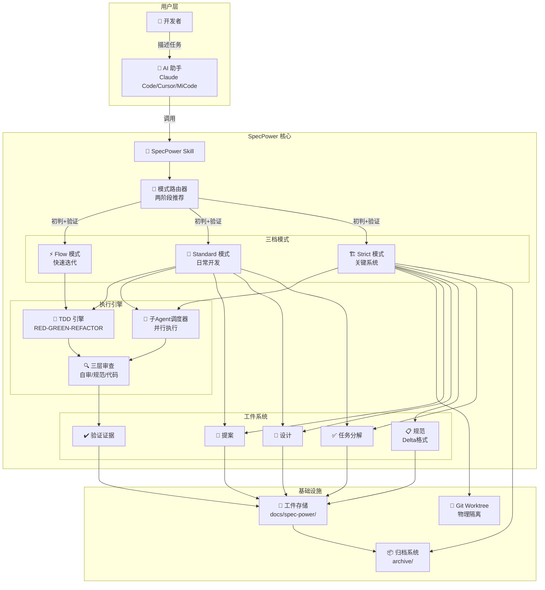

**关键组件说明**：
- **三档模式**: Flow（快速）、Standard（日常）、Strict（关键），根据任务复杂度自动推荐
- **执行引擎**: TDD 驱动 + 子 Agent 并行 + 三层审查保障质量
- **工件系统**: 从提案到验证的完整追溯链路
- **基础设施**: Worktree 隔离 + 工件存储 + 归档管理

---

## 3. 模式推荐决策流程

展示两阶段推荐机制：初判信号分析 → 快速验证（边界情况）→ 确认推荐。

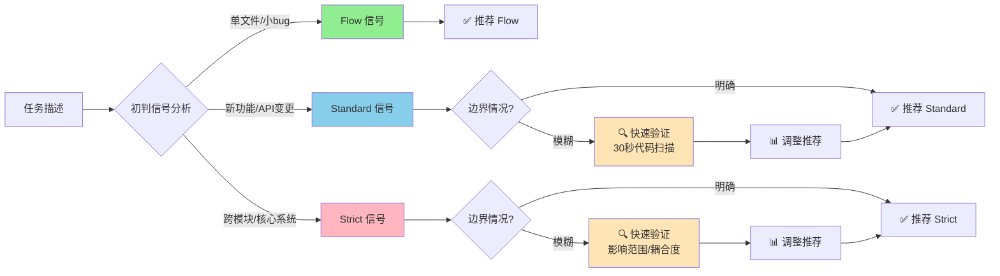

**推荐机制说明**：

**初判信号**：
- **Flow**: "修改 X.ts"、"修 typo"、"改配置值"、"快速搞定"
- **Standard**: "重构 XX 模块"、"添加功能"、涉及 API 和前端
- **Strict**: "跨多个模块"、"核心系统"、"团队协作"、"仔细做"

**快速验证**（仅边界情况触发，~30秒）：
- 第 1 步：影响范围（glob 数文件数量，找相关文件）
- 第 2 步：耦合度（grep 数引用次数，找关键类型）
- 第 3 步：测试覆盖（是否有测试）

**保守原则**: 疑似标准就选标准，避免过度工程化。

---

## 4. 上下文轻量注入四层架构

v1.8.0 核心创新：最小化子 agent 上下文消耗，四层模板总计约 2800 tokens。

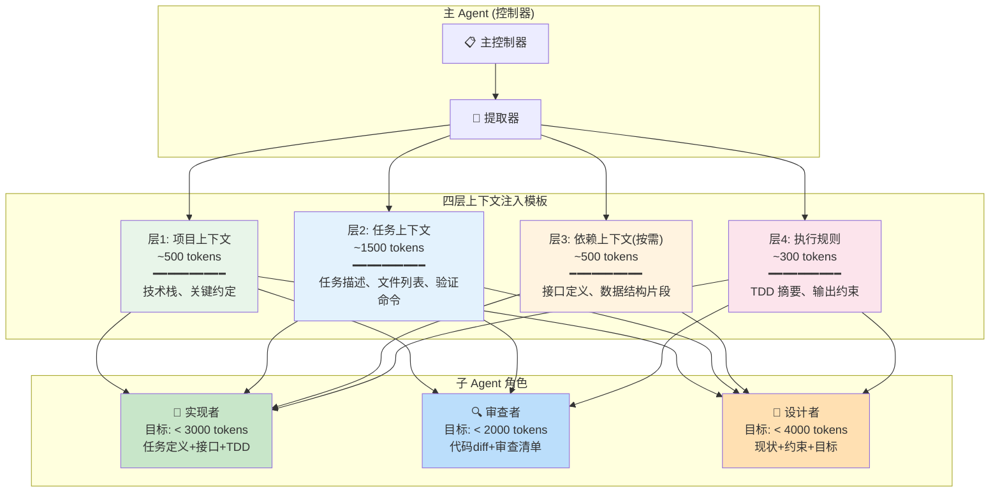

**四层详细说明**：

| 层级 | Token 目标 | 内容 | 来源 |
|-----|-----------|------|------|
| 层1: 项目上下文 | ~500 | 技术栈、关键约定（一段话） | 控制器从项目配置中提炼摘要 |
| 层2: 任务上下文 | ~1500 | 具体任务描述（全文）、文件列表、验证命令 | 控制器从 tasks.md 提取当前任务 |
| 层3: 依赖上下文 | ~500（按需） | 仅当前任务涉及的接口定义、数据结构 | 控制器从 design.md 提取相关片段 |
| 层4: 执行规则 | ~300 | TDD 三行摘要、输出约束 | 内联（不读完整文档） |

**注入量控制目标**：
- 实现者 agent: < 3000 tokens（任务定义 + 接口 + TDD 摘要）
- 审查者 agent: < 2000 tokens（代码 diff + 审查清单摘要）
- 设计者 agent: < 4000 tokens（现状 + 约束 + 目标）

**核心价值**: 相比全文注入节省约 70% tokens，显著降低成本和延迟。

---

## 5. 审查阈值规则矩阵

v1.8.0 核心创新：按模式差异化审查策略，Strict 模式更保守，Flow 模式最宽松。

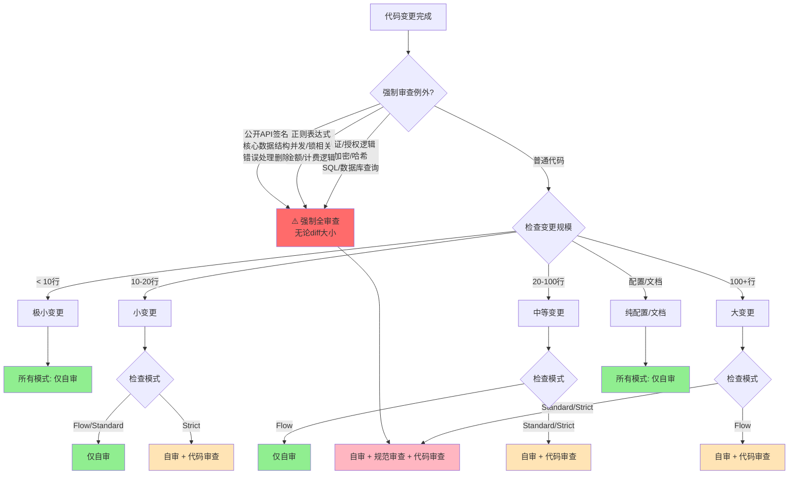

**审查阈值对照表**：

| 变更规模 | Flow | Standard | Strict |
|---------|------|----------|--------|
| 极小 (< 10 行) | 自审 | 自审 | 自审 |
| 小 (10-20 行) | 自审 | 自审 | 自审 + 代码审查 |
| 中 (20-100 行) | 自审 | 自审 + 代码审查 | 自审 + 代码审查 |
| 大 (100+ 行) | 自审 + 代码审查 | 自审 + 规范审查 + 代码审查 | 自审 + 规范审查 + 代码审查 |
| 纯配置/文档 | 自审 | 自审 | 自审 |

**简记**: Strict 从 10 行起触发子 agent 审查；Standard 从 20 行起；Flow 从 100 行起。

**9 类强制审查例外**（无论 diff 大小和模式，必须触发子 agent 审查）：
1. **认证/授权逻辑** - auth, permission, role, session, token 验证
2. **加密/哈希** - crypto, hash, secret, key 生成或验证
3. **SQL/数据库查询** - 查询构造、schema 变更、迁移脚本
4. **正则表达式修改** - ReDoS 风险（尤其是用户输入场景）
5. **并发/锁相关** - mutex, semaphore, atomic, race condition 区域
6. **金额/计费逻辑** - 价格计算、折扣、支付流程
7. **公开 API 签名** - 参数、返回值、错误码变更
8. **核心数据结构** - 影响多处消费者的 schema/interface 变更
9. **错误处理路径删除** - 移除 try/catch、error boundary、fallback

**Phase 7 补位职责**: 全局审查时必须回顾所有在 Phase 6 中跳过子 agent 审查的小变更，检查集成问题。

---

## 6. TDD 执行循环

RED-GREEN-REFACTOR 经典循环，SpecPower 的核心执行纪律。

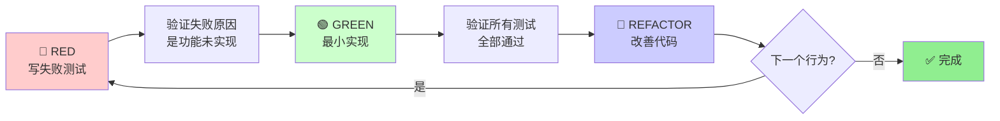

**完整流程说明**：

1. **RED** - 写一个会失败的测试，描述你期望的行为
2. **验证 RED** - 运行测试，确认失败原因是"功能未实现"（不是语法错误）
3. **GREEN** - 写**最少**的代码使测试通过，不要提前优化
4. **验证 GREEN** - 运行**全部**测试，确认新代码没有破坏已有功能
5. **REFACTOR** - 改善代码结构：提取函数、重命名变量、消除重复
6. **循环** - 回到 RED 开始下一个行为

**TDD 适用范围**（必须遵循）：
- ✅ 任何业务逻辑（if/else、循环、算法）
- ✅ 数据处理（解析、转换、验证）
- ✅ API/接口修改（路由、参数、返回值）
- ✅ Bug 修复（必须先写复现测试）

**TDD 豁免场景**（可以不写测试，但需要其他验证）：
- ✅ 纯配置文件修改（config.json, .env）→ 验证：运行系统观察配置生效
- ✅ 纯样式调整（CSS, SCSS）→ 验证：视觉检查 + 浏览器测试
- ✅ 文档修改（README, 注释）→ 验证：渲染效果检查
- ✅ 基础设施脚本（部署脚本、构建配置）→ 验证：运行脚本确认功能
- ✅ 静态资源（图片、字体）→ 验证：加载测试

**核心原则**: 豁免不代表不验证 - 每种豁免场景都有对应的验证方法，只是不需要写自动化测试。

**常见违规和纠正**：

| 违规 | 纠正 |
|------|------|
| 写了生产代码但没有对应测试 | 删掉代码，先写测试 |
| 测试失败原因是语法错误 | 修复测试语法，重新验证 RED |
| GREEN 阶段写了超出测试覆盖的代码 | 删掉多余代码，或补充测试 |
| REFACTOR 阶段加了新功能 | 回退，新功能走新的 RED-GREEN 循环 |
| 跳过了验证 RED | 回去运行测试，确认失败原因 |

---

## 7. 工件依赖关系图

所有模式（Flow/Standard/Strict）的工件生命周期对比。

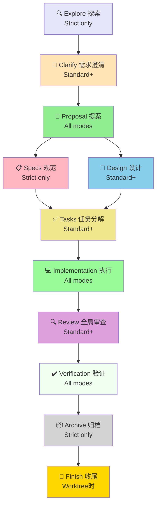

**工件生命周期说明**：

**Flow 模式**（最轻量）：
```
Proposal (口头30s) → Implementation → Verification
```

**Standard 模式**（日常开发）：
```
Clarify → Proposal → Design → Tasks → Implementation → Review → Verification
```

**Strict 模式**（关键系统）：
```
Explore → Clarify → Proposal → Specs → Design → Tasks → Implementation → Review → Verification → Archive → Finish
```

**工件说明**：

| 工件 | 适用模式 | 产出内容 | 存储位置 |
|-----|---------|---------|---------|
| Explore | Strict | 项目扫描、现有模式、影响范围、约束发现 | 体现在 proposal.md Context 部分 |
| Clarify | Standard+ | 需求澄清对话记录（1-3个关键问题） | 对话历史 |
| Proposal | All | 动机、范围、成功标准、影响评估 | proposal.md |
| Specs | Strict | Delta 格式规范（ADDED/MODIFIED/REMOVED） | specs/*.md |
| Design | Standard+ | 方案对比、技术决策、风险缓解 | design.md |
| Tasks | Standard+ | 可执行任务、依赖关系、验证清单 | tasks.md |
| Implementation | All | 代码实现 + TDD 测试 | 代码仓库 |
| Review | Standard+ | 全局审查报告、跨任务一致性 | review-report.md |
| Verification | All | 测试结果、性能数据、证据分级 | verification.md |
| Archive | Strict | 归档的完整工件 | docs/spec-power/archive/ |

---

## 8. 三层质量审查序列图

自审 → 规范审查 → 代码审查的完整流程，按阈值触发。

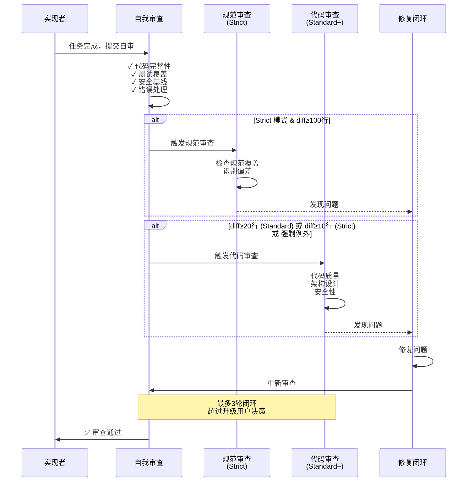

**三层审查详细说明**：

### 第一层：自我审查（所有模式，30秒）

**自审清单**：
- [ ] 代码完整性：所有函数都实现了？
- [ ] 测试覆盖：正常路径 + 边界 + 错误路径？
- [ ] 安全基线：无硬编码密钥、无 SQL 注入、有权限检查？
- [ ] 错误处理：外部调用有 try-catch？
- [ ] 类型安全：避免 any，使用具体类型？

### 第二层：规范审查（Strict 模式 + diff≥100行）

**审查员**: spec-reviewer 子 agent  
**职责**: 检查实现是否完整、正确地覆盖了规范要求

**产出示例**：
```
### 覆盖总结
- 总需求数: 12
- 已覆盖: 11
- 未覆盖: 1
- 覆盖率: 91.7%

### 偏差报告
#### [Critical] Requirement: 租户隔离
规范: 系统 MUST 支持多租户数据隔离
实现: 仅在应用层过滤，未在数据库层隔离
偏差类型: 偏离(风险)
建议: 添加数据库级的 tenant_id 索引
```

### 第三层：代码审查（按阈值触发）

**审查员**: code-reviewer 子 agent  
**职责**: 从代码质量、架构设计、安全性角度审查

**触发条件**：
- Standard 模式: diff ≥ 20 行
- Strict 模式: diff ≥ 10 行
- Flow 模式: diff ≥ 100 行
- 或符合 9 类强制例外

**产出示例**：
```
### 问题列表
#### [Critical] SQL 注入风险
文件: src/services/user-service.ts:45
问题: userId 直接拼接到 SQL 查询
修复: 使用参数化查询

#### [Important] 缺少错误处理
文件: src/services/s3-client.ts:23
问题: s3Client.upload 没有 try-catch
建议: 添加错误处理，记录日志

### 亮点
- 类型定义清晰，无 any
- 测试覆盖全面，包含边界情况
```

**修复闭环规则**：
- **Critical 问题**: 必须修复，修复后必须重审
- **Important 问题**: 应该修复，除非有充分理由
- **Suggestion 问题**: 记录但不阻塞
- **最多 3 轮闭环**，超过升级给用户决策

---

## 9. Git Worktree 生命周期

Strict 模式专属：物理隔离 + 四种收尾选项。

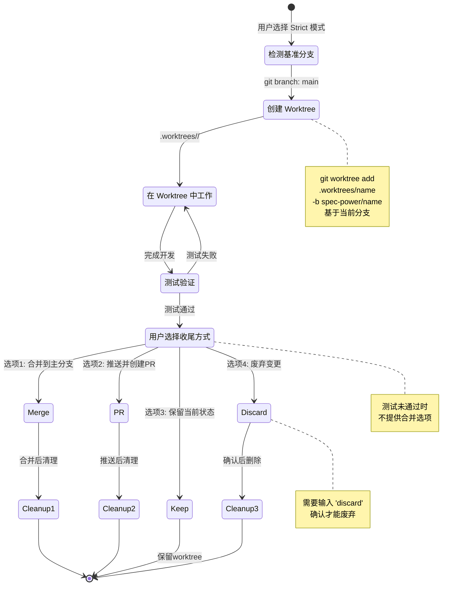

**Worktree 创建流程**：

```bash
# 1. 检测当前分支（基准分支）
git rev-parse --abbrev-ref HEAD
# 输出: feature/login

# 2. 创建 worktree
git worktree add .worktrees/refactor-auth-20260408143025 \
  -b spec-power/refactor-auth-20260408143025 \
  feature/login

# 3. 切换到 worktree
cd .worktrees/refactor-auth-20260408143025
```

**双重隔离机制**：
- **逻辑隔离**: 变更目录 `docs/spec-power/changes/<name>/`（工件组织）
- **物理隔离**: Worktree `.worktrees/<name>/`（代码分支）

**四种收尾选项详解**：

### 选项 1：合并到主分支

```bash
# 切到主分支
cd /path/to/main-repo
git checkout feature/login
git pull

# 合并
git merge spec-power/refactor-auth-20260408143025

# 验证测试
npm test

# 清理
git worktree remove .worktrees/refactor-auth-20260408143025
git branch -d spec-power/refactor-auth-20260408143025
```

**适用场景**: 变更已完成，测试通过，直接合并到主分支。

### 选项 2：推送并创建 PR

```bash
# 在 worktree 中推送
git push -u origin spec-power/refactor-auth-20260408143025

# 创建 PR
gh pr create --title "Refactor auth system for multi-tenancy" \
  --body "See docs/spec-power/changes/refactor-auth-20260408143025/proposal.md"

# 清理 worktree（代码已推送到远端）
git worktree remove .worktrees/refactor-auth-20260408143025
```

**适用场景**: 需要代码审查、团队协作、持续集成验证。

### 选项 3：保留当前状态

不清理 worktree，稍后处理。Worktree 和分支继续存在。

**适用场景**: 暂时切换到其他任务，稍后继续这个变更。

### 选项 4：废弃变更

```bash
# 需要输入 'discard' 确认
git worktree remove .worktrees/refactor-auth-20260408143025
git branch -D spec-power/refactor-auth-20260408143025
```

**适用场景**: 变更方案不可行，完全废弃。

**安全机制**：
- ✅ 测试未通过不提供合并选项
- ✅ 废弃需用户输入 'discard' 确认
- ✅ 合并后再次验证测试

---

## 10. 多角色设计对比流程

Strict Phase 4 专属：三视角并行设计 + 5 维度对比矩阵。

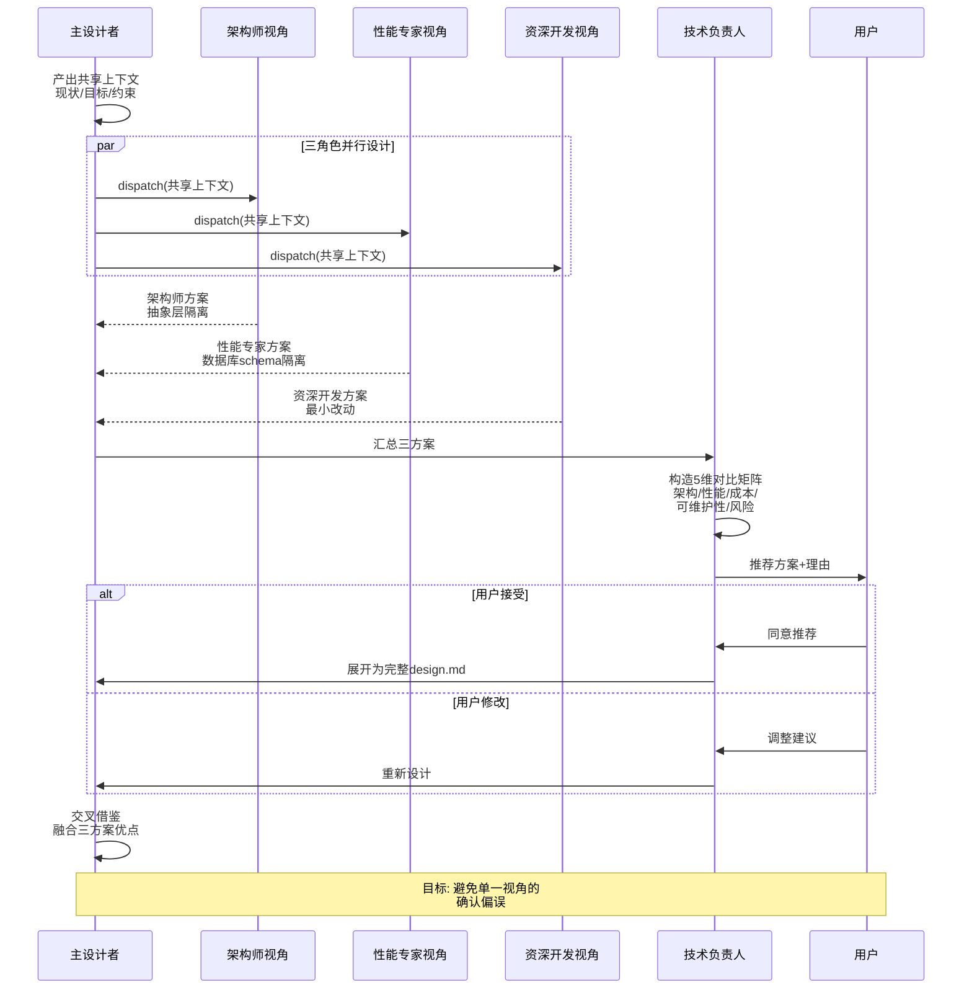

**多角色设计工作流**：

### Phase 1: 共享上下文构造

主设计者产出共享上下文（所有角色共用）：

```markdown
## 现状
- 单租户认证系统，使用 JWT + Redis Session
- 核心模块：AuthService、JwtProvider、SessionStore
- 20+ API 路由使用 authMiddleware
- 无测试覆盖

## 目标
- 支持多租户，每个租户数据完全隔离
- 保持现有 JWT 格式（移动端依赖）
- 性能不降低（登录 P95 < 200ms）

## 非目标
- 不支持租户间的用户迁移
- 不支持租户级别的定制化 UI

## 硬约束
- 必须通过 Q3 安全审计
- 必须保持向后兼容（旧客户端继续工作）
- 预算：4 周开发时间
```

### Phase 2: 三角色并行设计

三个子 agent 同时工作，各自从不同视角产出方案：

**🏛️ 架构师视角**：
- **关注点**: 可维护性、模块解耦、长期演进
- **核心策略**: 引入 TenantContext 抽象层
- **优势**: 模块解耦，可独立测试
- **代价**: 增加一层抽象，性能开销约 5%

**⚡ 性能专家视角**：
- **关注点**: 性能优化、资源消耗、可扩展性
- **核心策略**: 数据库 schema 隔离
- **优势**: 性能最优，无跨租户查询开销
- **代价**: 数据库连接数增加，迁移复杂度高

**🛠️ 资深开发视角**：
- **关注点**: 实现成本、交付周期、风险控制
- **核心策略**: 在现有 User 表添加 tenant_id 字段
- **优势**: 开发成本最低（2天完成）
- **代价**: 性能开销，安全风险

### Phase 3: 5 维度对比矩阵

技术负责人汇总三方案，构造对比矩阵：

| 维度 | 架构师方案 | 性能专家方案 | 资深开发方案 |
|------|-----------|-------------|-------------|
| 架构合理性 | ⭐⭐⭐⭐⭐ | ⭐⭐⭐⭐ | ⭐⭐⭐ |
| 性能表现 | ⭐⭐⭐⭐ | ⭐⭐⭐⭐⭐ | ⭐⭐⭐ |
| 开发成本 | ⭐⭐⭐ (3周) | ⭐⭐ (4周) | ⭐⭐⭐⭐⭐ (2天) |
| 可维护性 | ⭐⭐⭐⭐⭐ | ⭐⭐⭐⭐ | ⭐⭐⭐ |
| 风险程度 | ⭐⭐⭐ (中) | ⭐⭐ (高) | ⭐⭐⭐⭐ (低) |

**推荐**: 采用架构师方案，因为：
- 长期可维护性最重要（这个系统要维护 3+ 年）
- 性能开销可接受（5% 在预算内）
- 团队规模会增长（需要清晰的架构）

### Phase 4: 交叉借鉴

融合三方案优点：
- 从性能专家方案借鉴：缓存按租户分区
- 从资深开发方案借鉴：第一阶段先支持核心租户，渐进式 rollout

**多角色设计的核心价值**：
- 🎯 避免单一视角的确认偏误
- 🔄 从不同优化目标产出竞争性方案
- 📊 关键系统的设计决策值得多角度审视
- 🤝 交叉借鉴，取长补短

---

## 11. 系统调试四阶段流程

系统化的问题解决流程：根因调查 → 假设形成 → 验证 → 修复。

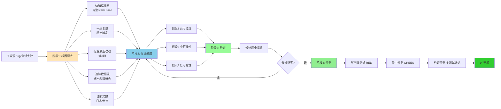

**核心原则**: **不知道原因之前不要修复**

### 阶段一: 根因调查

这是最重要的阶段。必须完成后才能进入下一阶段。

**步骤**：
1. **仔细读错误信息** - 完整读，包括 stack trace。不要只看最后一行。
2. **一致复现** - 确保能稳定触发问题。如果随机出现，先找到稳定复现路径。
3. **检查最近改动** - `git diff` 看看最近改了什么。问题通常出在最近改动的代码里。
4. **追踪数据流** - 从输入到出错点，一步步跟踪数据怎么流过系统。
5. **诊断装置** - 在关键点添加日志/断点，缩小问题范围。

**常见陷阱**：
- ❌ 只看表面症状而非根因
- ❌ "上次也是这样"的经验偏见
- ❌ 在不理解问题的情况下乱改代码

### 阶段二: 假设形成

基于根因调查的证据，形成可能原因的假设列表：

```
假设 1 (高可能性): 数据库连接池耗尽导致超时
  证据: 错误日志显示 "connection timeout"，监控显示连接数接近上限
  
假设 2 (中可能性): 查询未使用索引导致慢查询
  证据: explain 显示全表扫描

假设 3 (低可能性): 网络问题
  证据: 无直接证据，但不能排除
```

### 阶段三: 验证

为每个假设设计**最小实验**来证明或反驳：

```
假设 1 验证方案: 增大连接池到 50，观察是否还超时
假设 2 验证方案: 添加索引，对比查询时间
假设 3 验证方案: ping 数据库服务器，检查延迟
```

从最高可能性的假设开始验证。一个假设被证实就可以进入修复阶段。

### 阶段四: 修复

确认根因后才能修复。修复时：

1. **写回归测试** - 先写一个复现 bug 的测试（RED）
2. **最小修复** - 只修复根因，不顺手改其他东西
3. **验证修复** - 运行回归测试（GREEN）+ 全部测试
4. **理解为什么** - 如果修复后问题消失但你不理解为什么，继续调查。偶然修复会留下隐患。

**条件等待 vs 超时**：

当代码需要等待异步操作时，使用条件等待而非固定超时：

```typescript
// 差 - 固定超时
await sleep(5000);
expect(result).toBeDefined();

// 好 - 条件等待
await waitFor(() => result !== undefined, { timeout: 5000, interval: 100 });
expect(result).toBeDefined();
```

---

## 12. 平台兼容性架构

SpecPower 支持多平台，核心能力全平台可用，高级特性优雅降级。

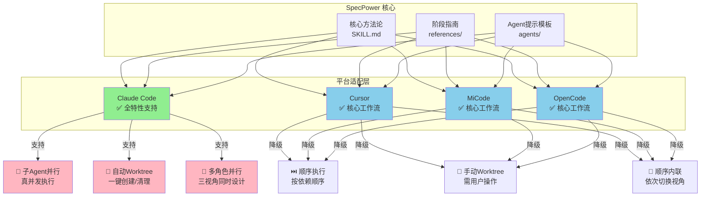

**平台特性对比表**：

| 能力 | Claude Code | Cursor | MiCode | OpenCode |
|------|-------------|--------|--------|----------|
| 三档模式 | ✅ 完整支持 | ✅ 完整支持 | ✅ 完整支持 | ✅ 完整支持 |
| TDD 流程 | ✅ 完整支持 | ✅ 完整支持 | ✅ 完整支持 | ✅ 完整支持 |
| 工件系统 | ✅ 完整支持 | ✅ 完整支持 | ✅ 完整支持 | ✅ 完整支持 |
| 子 Agent 并行 | ✅ 真并发 | ⚠️ 顺序内联 | ⚠️ 顺序内联 | ⚠️ 顺序内联 |
| 多角色设计 | ✅ 三视角并行 | ⚠️ 顺序切换 | ⚠️ 顺序切换 | ⚠️ 顺序切换 |
| 自动 Worktree | ✅ 一键管理 | ⚠️ 需手动操作 | ⚠️ 需手动操作 | ⚠️ 需手动操作 |
| 三层审查 | ✅ 子 agent | ✅ 清单驱动 | ✅ 清单驱动 | ✅ 清单驱动 |

**安装路径**：

| 平台 | 用户级安装 | 项目级安装 |
|------|-----------|-----------|
| Claude Code | `~/.claude/skills/` | `.claude/skills/` |
| Cursor | `~/.cursor/skills/` | `.cursor/skills/` |
| MiCode | `~/.micode/skills/` | `.micode/skills/` |
| OpenCode | `~/.config/opencode/skills/` | `.opencode/skills/` |

**降级策略说明**：

**无子 agent 时的行为**：
- **多角色设计** → 顺序内联（主 agent 依次切换视角）
- **逐任务审查** → 清单驱动的自审
- **并行执行** → 顺序执行

**所有工件和质量规则不变**

**关键信息**: 即使没有子 agent 支持，SpecPower 的核心价值（三档模式、TDD、工件系统、质量审查）仍然完整可用。

---

## 13. Phase 流转图（Standard 模式）

Standard 模式的完整生命周期，支持阶段回退。

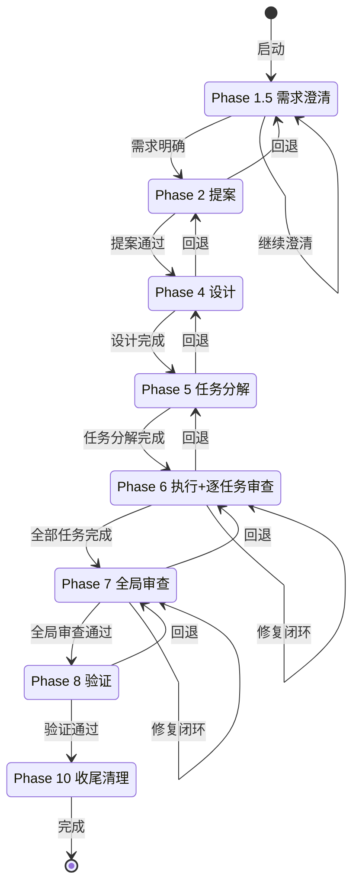

**Standard 模式 Phase 说明**：

| Phase | 名称 | 产出 | 典型耗时 |
|-------|------|------|---------|
| 1.5 | 需求澄清 | 1-3 个关键问题澄清 | 10 分钟 |
| 2 | 提案 | proposal.md | 10 分钟 |
| 4 | 设计 | design.md | 30 分钟 |
| 5 | 任务分解 | tasks.md | 20 分钟 |
| 6 | 执行+逐任务审查 | 代码实现 + 审查报告 | 2-3 小时 |
| 7 | 全局审查 | 跨任务一致性检查 | 30 分钟 |
| 8 | 验证 | verification.md | 15 分钟 |
| 10 | 收尾清理 | Git 整合 | 5 分钟 |

**阶段回退协议**：
- 发现问题时可回退到前置阶段
- 保留已有工作，不重头开始
- 修复后继续向前推进

---

## 14. Phase 流转图（Strict 模式）

Strict 模式的完整生命周期，增加探索、规范、归档等阶段。

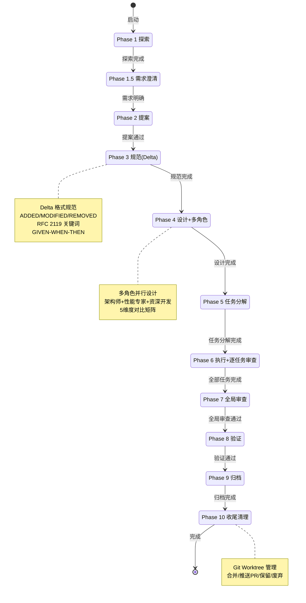

**Strict 模式 Phase 说明**：

| Phase | 名称 | 产出 | 典型耗时 |
|-------|------|------|---------|
| 1 | 探索 | 现状分析、影响范围 | 15 分钟 |
| 1.5 | 需求澄清 | 完整需求澄清 | 20 分钟 |
| 2 | 提案 | proposal.md | 15 分钟 |
| 3 | 规范 | specs/*.md（Delta 格式） | 30 分钟 |
| 4 | 设计+多角色 | design.md（三方案对比） | 1 小时 |
| 5 | 任务分解 | tasks.md | 30 分钟 |
| 6 | 执行+逐任务审查 | 代码实现 + 审查报告 | 4-8 小时 |
| 7 | 全局审查 | 跨任务一致性检查 | 1 小时 |
| 8 | 验证 | verification.md | 30 分钟 |
| 9 | 归档 | 归档到 archive/ | 15 分钟 |
| 10 | 收尾清理 | Worktree 管理 | 15 分钟 |

**Strict 模式特色**：

1. **Delta 规范格式**（Phase 3）：
   - ADDED/MODIFIED/REMOVED 结构
   - RFC 2119 关键词（MUST/SHOULD/MAY）
   - GIVEN-WHEN-THEN 场景描述
   - 增量式行为描述，多变更无冲突

2. **多角色并行设计**（Phase 4）：
   - 三视角并行：架构师 + 性能专家 + 资深开发
   - 5 维度对比：架构/性能/成本/可维护性/风险
   - 交叉借鉴，融合优点

3. **Git Worktree 隔离**（整个流程）：
   - 物理隔离，独立分支
   - 四种收尾选项：合并/推送PR/保留/废弃
   - 测试未通过不提供合并选项

4. **完整归档**（Phase 9）：
   - 合并 Delta 规范到主规范
   - 移动变更目录到 archive/
   - 保留完整工件供追溯

---

## 架构设计总结

### v1.8.0/v1.8.1 版本核心创新

**🎯 轻量注入原则**（Token 优化）：
- 四层上下文模板：层1(500) + 层2(1500) + 层3(500) + 层4(300) = ~2800 tokens
- 角色目标：实现者 < 3K、审查者 < 2K、设计者 < 4K
- 对比全文注入节省约 70% tokens

**📏 审查阈值规则**（按模式差异化）：
- Strict 模式：10 行起触发子 agent 审查（最保守）
- Standard 模式：20 行起触发子 agent 审查（适中）
- Flow 模式：100 行起触发子 agent 审查（最宽松）
- 9 类强制例外：认证/加密/SQL/正则/并发/金额/API/核心结构/错误处理删除

**🛡️ Phase 7 补位职责**：
- 全局审查时回顾所有跳过子 agent 审查的小变更
- 检查多个小变更组合是否产生集成问题
- 识别跳过审查的变更是否存在遗漏的例外情况

### 架构设计原则

1. **规划深度匹配任务复杂度** - Flow/Standard/Strict 三档模式自适应
2. **质量门控保障关键节点** - 三层审查 + 修复闭环 + 按模式差异化
3. **灵活迭代而非瀑布僵化** - 支持阶段回退 + 跨会话恢复 + 渐进式交付
4. **Token 效率优先** - 轻量注入原则 + 阈值规则 + 只注入相关片段
5. **平台兼容性** - 核心能力全平台支持 + 优雅降级策略

### 使用建议

**团队培训**：
- 用图 1（整体架构）+ 图 2（模式推荐）快速建立全局认知
- 用图 5（TDD）+ 图 7（三层审查）讲解质量保障体系
- 用图 9（多角色设计）展示 Strict 模式的高价值

**技术方案评审**：
- 用图 6（工件依赖）展示完整追溯链路
- 用图 8（Worktree）说明关键变更的隔离机制
- 用图 4（审查阈值）展示差异化质量策略

**新人快速上手**：
- 先看图 1（整体架构）理解全貌
- 再看图 2（模式推荐）学会选模式
- 最后看图 5（TDD）+ 图 10（调试）掌握执行方法

**系统演进规划**：
- 图 3（轻量注入）+ 图 4（审查阈值）是 v1.8.0 的创新
- 图 11（平台兼容）展示扩展方向
- 所有架构图随版本更新保持同步

---

**SpecPower - 让复杂开发变得简单、可控、高质量**

Built with ❤️ by developers, for developers
